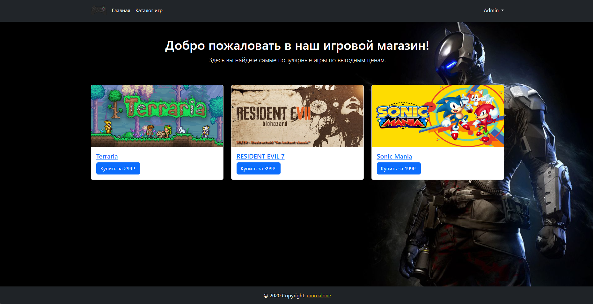
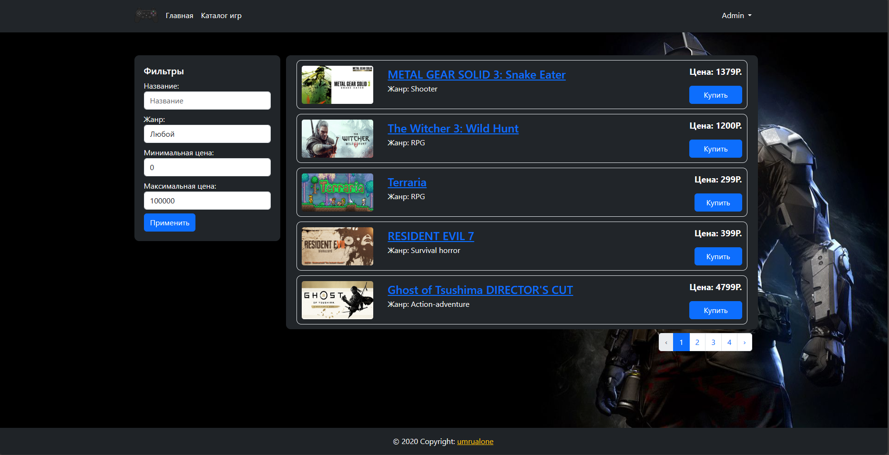
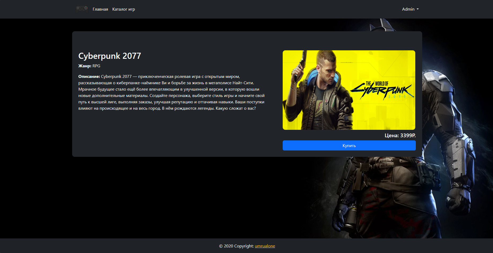
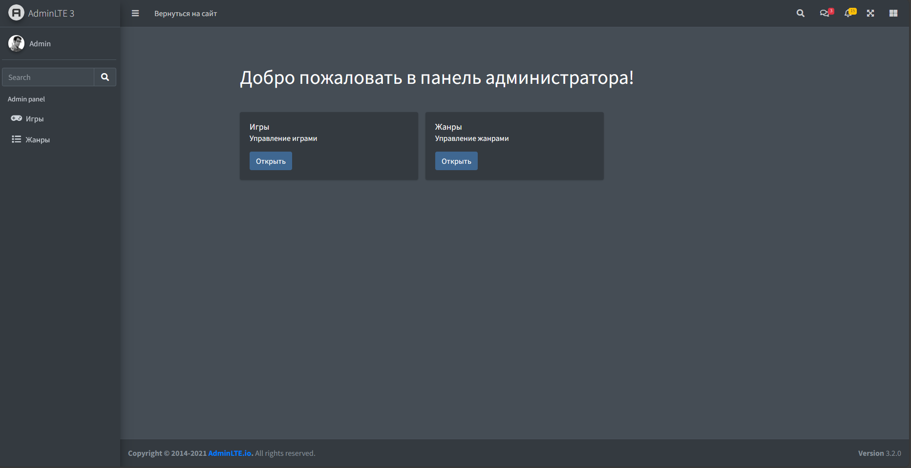
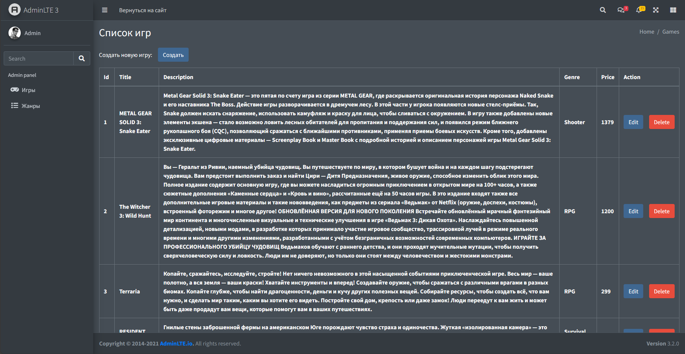

# Laravel-GameStore

## Ссылки
1. [Описание проекта](#description)
2. [Скриншоты](#screenshots)
3. [Запуск](#start)


___
<a id="description"></a>
## Описание
Проект создан с использованием фреймворка Laravel
и административного шаблона AdminLTE.
### Основные функции
* Админ панель обеспечивающая управление контентом магазина.
* Основные функции управления играми (CRUD).
* Регистрация и аутентификация пользователя.
* Middleware, проверяющий права доступа к панели администратора.
* Поиск и фильтрация игр.

___
<a id="sreenshots"></a>
## Скриншоты

 



___
<a id="start"></a>
## Запуск
Для запуска проект нужно сделать следующие шаги.
1. Устанавливаем зависимости для php и js
```bash
composer install
npm install
```
2. Делаем сборку
```bash
npm run build
```
3. Изменяем .env.examle на .env и заполняем необходимые настройки бд
4. Генерируем ключ шифрования
```bash
php artisan key:generate
```
5. Делаем миграцию.
```bash
php artisan migrate
```
6. Заполняем бд данными
```bash
php artisan db:seed
```
7. Добавляем ссылку на картинки
```bash
php artisan storage:link
```
8. Запускаем проект
```bash
php artisan serve
```

Начальный аккаунт администратора  
email: test@gmail.com  
password: password
